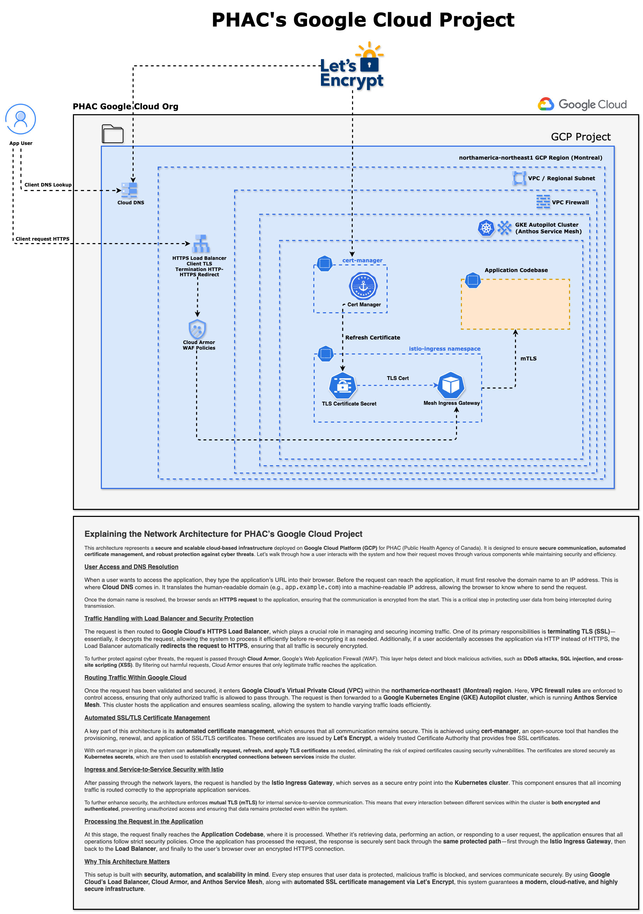

# PHAC's Google Cloud Project

## Explaining the Network Architecture for PHAC’s Google Cloud Project

This architecture represents a **secure and scalable cloud-based infrastructure** deployed on **Google Cloud Platform (GCP)** by **PHAC (Public Health Agency of Canada)**. It is designed to ensure **secure communication, fully automated certificate management, and robust protection** against cyber threats. Let’s walk through how a user interacts with the system and how their request moves through various components while maintaining security and efficiency.

---

## User Access and DNS Resolution

When a user wants to access the application, they type the application’s **URL** into their browser. Before the request can reach the application, it must first resolve the domain name to an IP address. This is where **Cloud DNS** comes in. It translates the human-readable domain (e.g., `app.example.ca`) into a machine-readable IP address, allowing the browser to know where to send the request.

Once the domain name is resolved, the browser sends an **HTTPS request** to the application, ensuring that the communication is encrypted from the start. This is a critical step in protecting user data from being intercepted during transmission.

---

## Traffic Handling with Load Balancer and Security Protection

The request is then routed to **Google Cloud’s External HTTPS Load Balancer**, which plays a crucial role in managing and securing incoming traffic. Its primary responsibilities are:

1.  **TLS Termination**: It uses a **Google-managed SSL certificate** to decrypt the incoming HTTPS request, allowing for inspection and efficient routing.
2.  **HTTP-to-HTTPS Redirection**: If a user accidentally accesses the application via **HTTP**, the Load Balancer automatically redirects the request to **HTTPS**, ensuring all traffic remains securely encrypted.

To further protect against cyber threats, the request is passed through **Cloud Armor**, Google’s **Web Application Firewall (WAF)**. This layer helps detect and block malicious activities, such as **DDoS attacks, SQL injection, and cross-site scripting (XSS)**. By filtering out harmful requests, **Cloud Armor** ensures that only legitimate traffic reaches the application.

---

## Routing Traffic Within Google Cloud

Once the request has been validated and secured, it enters **Google Cloud’s Virtual Private Cloud (VPC)** within the **northamerica-northeast1 (Montreal) region**. Here, **VPC firewall rules** are enforced to control access, ensuring that only authorized traffic is allowed to pass through.

The request is then forwarded to a **Google Kubernetes Engine (GKE) Autopilot cluster**. This cluster hosts the application and ensures seamless scaling, allowing the system to handle varying traffic loads efficiently.

---

## Automated SSL/TLS Certificate Management

A key part of this architecture is **fully automated certificate management**, which is handled directly by Google Cloud. This approach simplifies security and eliminates the operational overhead of manual renewals.

Instead of using in-cluster tools, this architecture uses **Google-managed certificates**. These certificates are provisioned, deployed, and renewed automatically by Google.

The certificate is attached directly to the **Google Cloud HTTPS Load Balancer**, which means:
-   **No Manual Intervention**: Google handles the entire lifecycle, from issuance to renewal, preventing outages from expired certificates.
-   **Enhanced Security**: The certificate and its private key are managed securely by Google, never exposed within the GKE cluster.
-   **Simplified Operations**: There is no need to run or maintain tools like `cert-manager` inside the cluster for public-facing endpoints.

---

## Ingress and Routing to Application Services

After passing through the network layers, the request is routed into the Kubernetes cluster using the **GKE Gateway API**.

The `Gateway` resource defines the external load balancer, and `HTTPRoute` resources define how traffic for specific hostnames and paths is directed to the correct backend services inside the cluster. This provides a flexible and standardized way to manage ingress traffic without needing a separate service mesh for basic routing.

---

## Processing the Request in the Application

At this stage, the request finally reaches the **Application Codebase**, where it is processed. Whether it’s retrieving data, performing an action, or responding to a user request, the application ensures that **all operations follow strict security policies**.

Once the application has processed the request, the response is securely sent back through the same **protected path**—from the application service to the **Load Balancer**, and finally to the **user’s browser over an encrypted HTTPS connection**.

---

## Why This Architecture Matters

This system is built with **security, automation, and scalability** in mind. **Every step ensures that:**

-   **All data is protected** using encryption.
-   **Malicious traffic is blocked** before it reaches the application.
-   **Certificate management is fully automated** by Google, reducing operational risk.

By using **Google Cloud’s managed services like the External HTTPS Load Balancer, Cloud Armor, and Google-managed certificates**, this system provides a modern, cloud-native, and highly secure infrastructure.
