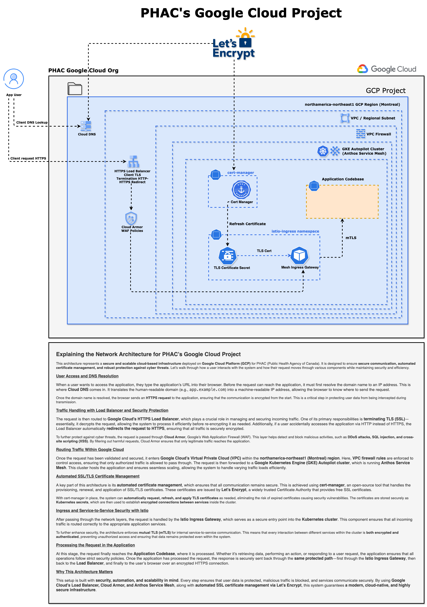

# PHAC's Google Cloud Project

## Explaining the Network Architecture for PHAC’s Google Cloud Project

This architecture represents a **secure and scalable cloud-based infrastructure** deployed on **Google Cloud Platform (GCP)** by **PHAC (Public Health Agency of Canada)**. It is designed to ensure **secure communication, automated certificate management, and robust protection** against cyber threats. Let’s walk through how a user interacts with the system and how their request moves through various components while maintaining security and efficiency.

---

## User Access and DNS Resolution

When a user wants to access the application, they type the application’s **URL** into their browser. Before the request can reach the application, it must first resolve the domain name to an IP address. This is where **Cloud DNS** comes in. It translates the human-readable domain (e.g., `app.example.ca`) into a machine-readable IP address, allowing the browser to know where to send the request.

Once the domain name is resolved, the browser sends an **HTTPS request** to the application, ensuring that the communication is encrypted from the start. This is a critical step in protecting user data from being intercepted during transmission.

---

## Traffic Handling with Load Balancer and Security Protection

The request is then routed to **Google Cloud’s HTTPS Load Balancer**, which plays a crucial role in managing and securing incoming traffic. One of its primary responsibilities is **terminating TLS (SSL)**—essentially, it decrypts the request, allowing the system to process it efficiently before re-encrypting it as needed. Additionally, if a user accidentally accesses the application via **HTTP** instead of **HTTPS**, the Load Balancer automatically redirects the request to **HTTPS**, ensuring that all traffic remains securely encrypted.

To further protect against cyber threats, the request is passed through **Cloud Armor**, Google’s **Web Application Firewall (WAF)**. This layer helps detect and block malicious activities, such as **DDoS attacks, SQL injection, and cross-site scripting (XSS)**. By filtering out harmful requests, **Cloud Armor** ensures that only legitimate traffic reaches the application.

---

## Routing Traffic Within Google Cloud

Once the request has been validated and secured, it enters **Google Cloud’s Virtual Private Cloud (VPC)** within the **northamerica-northeast1 (Montreal) region**. Here, **VPC firewall rules** are enforced to control access, ensuring that only authorized traffic is allowed to pass through. 

The request is then forwarded to a **Google Kubernetes Engine (GKE) Autopilot cluster**, which is running **Anthos Service Mesh**. This cluster hosts the application and ensures seamless scaling, allowing the system to handle varying traffic loads efficiently.

---

## Automated SSL/TLS Certificate Management

A key part of this architecture is **automated certificate management**, which ensures that all communication remains secure. This is achieved using **cert-manager**, an open-source tool that handles the **provisioning, renewal, and application of SSL/TLS certificates**. 

These certificates are issued by **Let’s Encrypt**, a widely trusted **Certificate Authority (CA)**.

With **cert-manager**, the system can automatically request, renew, and apply **TLS certificates** and enforce **mTLS (mutual TLS)** authentication between services. This allows the system to establish **encrypted connections between microservices**, reducing the risk of expired certificates causing security vulnerabilities. The certificates are stored securely as **Kubernetes Secrets**.

---

## Ingress and End-to-End Service Security with Istio

After passing through the network layers, the request is routed to the **Istio Ingress Gateway**, which serves as a **secure entry point into the Kubernetes cluster**. This component ensures that all incoming traffic is routed **correctly** to the appropriate application services.

To further enhance security, the architecture enforces **mutual TLS (mTLS)** for internal service-to-service communication. This means that every interaction between different services within the cluster is **both encrypted and authenticated**, preventing unauthorized access and ensuring that remote attackers **cannot impersonate** a service.

---

## Processing the Request in the Application

At this stage, the request finally reaches the **Application Codebase**, where it is processed. Whether it’s retrieving data, performing an action, or responding to a user request, the application ensures that **all operations follow strict security policies**. 

Once the application has processed the request, the response is securely sent back through the same **protected path**—first through the **Istio Ingress Gateway**, then back to the **Load Balancer**, and finally to the **user’s browser over an encrypted HTTPS connection**.

---

## Why This Architecture Matters

This system is built with **security, automation, and scalability** in mind. **Every step ensures that:**
- **All data is protected** using encryption.
- **Malicious traffic is blocked** before it reaches the application.
- **Services communicate securely** using **mTLS authentication**.

By using **Google Cloud’s Load Balancer, Cloud Armor, and Anthos Service Mesh**, along with **automated SSL certificate management via Let’s Encrypt**, this system guarantees a **modern, cloud-native, and highly secure** infrastructure.
