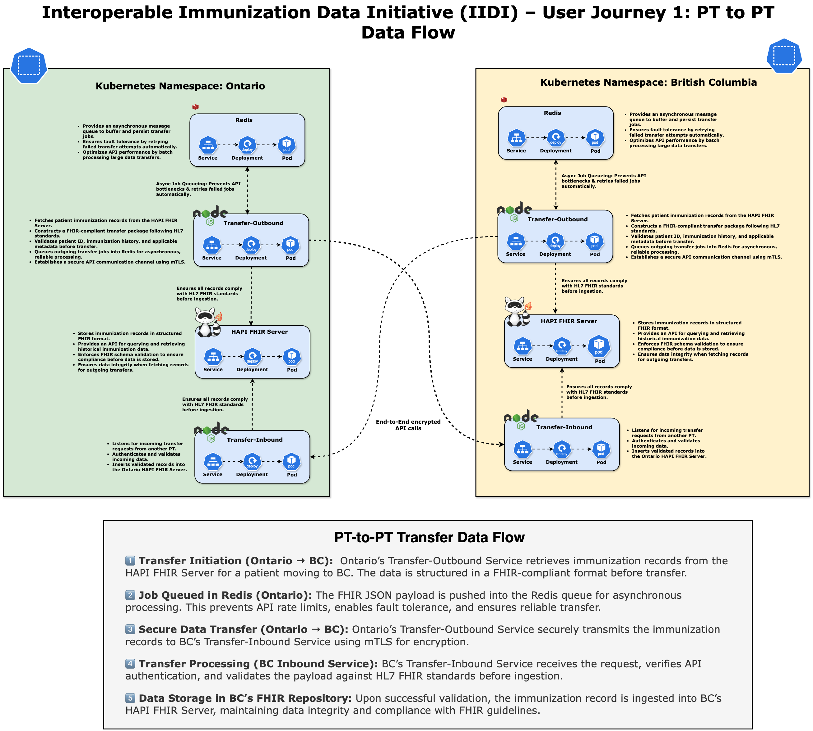

# **Interoperable Immunization Data Initiative (IIDI) – User Journey 1: PT-to-PT Transfer**

## **Technical Architecture and Implementation for Secure Cross-Provincial Data Exchange**

## **1. Introduction**

The **Interoperable Immunization Data Initiative (IIDI)** is designed to facilitate a **secure, standards-based, and interoperable** approach for immunization record exchange across **Provincial and Territorial (PT) jurisdictions** in Canada. As part of this initiative, **User Journey 1** focuses on the **technical implementation of PT-to-PT transfers**, ensuring a scalable, Kubernetes-native solution that aligns with modern security, compliance, and interoperability best practices.

This document provides a **comprehensive technical breakdown of the PT-to-PT immunization data exchange**, covering system architecture, data flow, security measures, and infrastructure details. It is important to emphasize that this document strictly focuses on the **technical aspects** of the transfer. Governance, consent frameworks, and policy considerations are **explicitly out of scope** at this stage, as the assumption is that PTs will handle **out-of-band consent and authorization mechanisms** prior to initiating a transfer.

The technical model assumes a **push-based** transfer mechanism where the **originating PT (data owner) initiates the record transmission** only after an external approval process. The system is designed with **privacy, security, and reliability** in mind, utilizing industry-standard protocols such as **FHIR (Fast Healthcare Interoperability Resources), OAuth2, mTLS encryption, and Kubernetes-native deployments.**

---

## **2. System Architecture**

The **PT-to-PT transfer mechanism** is built on a **decentralized, API-driven architecture** where each PT maintains its **own independent namespace within a Kubernetes cluster** while adhering to a standardized data exchange model. The architecture is designed to be **scalable, secure, and easily extendable**, allowing additional provinces to onboard without requiring modifications to the existing infrastructure.

Each **PT namespace** is deployed on **Google Kubernetes Engine (GKE)** and managed using **GitOps best practices** through **ArgoCD and Kustomize**. This ensures a declarative, auditable, and version-controlled infrastructure while maintaining a consistent deployment pipeline across multiple jurisdictions.

The **core architectural components** of the PT-to-PT transfer model include the following:

### **PT-Specific Components (Ontario, British Columbia, etc.)**

Each PT namespace consists of the following services, which collectively manage immunization data storage, retrieval, and secure transmission:

- **HAPI FHIR Server**: A FHIR-compliant immunization data repository that serves as the authoritative source for immunization records in each PT.
- **CloudNativePG (CNPG) Database**: A high-availability PostgreSQL-based persistence layer, deployed as a Kubernetes-native managed service to store immunization records securely.
- **Redis Cache**: A high-performance message queue and caching layer, enabling asynchronous job execution for queued transfer requests, ensuring reliable record transmission.
- **Transfer Services (Outbound and Inbound)**: Microservices responsible for initiating, processing, and validating data transfers, ensuring compliance with FHIR schema and security policies.

### **Secure PT-to-PT Data Exchange Layer**

To facilitate **inter-provincial immunization data exchange**, the system relies on a **highly secure, API-based transfer model** that incorporates:

- **FHIR RESTful APIs** for structured immunization record retrieval and transmission.
- **FHIR Bulk Data APIs** for high-volume data exchange, ensuring minimal latency and optimized resource consumption.
- **Asynchronous Processing via Redis** to queue and handle transfer requests without blocking system resources.
- **Encryption with mTLS** to prevent unauthorized access and data interception.

Each PT operates independently, but **standardized interfaces and shared security models ensure seamless interoperability.**

---

## **3. PT-to-PT Data Transfer Process**

### **3.1 Transfer Workflow**

The **PT-to-PT data transfer process** follows a structured, stepwise approach to ensure **data consistency, security, and regulatory compliance** while maintaining operational efficiency.

1. **Initiating the Transfer**: When a patient moves or requires immunization records in another jurisdiction, the receiving PT requests the immunization history from the originating PT through an **external, policy-driven process**.
2. **Outbound Transfer Service Execution**: The **originating PT validates the transfer request**, retrieves the relevant immunization records from the **HAPI FHIR Server**, and structures the data for secure transmission.
3. **Secure Data Transmission**: The data is **queued in Redis**, encrypted using **mTLS**, and transmitted to the receiving PT’s **Inbound Transfer Service**.
4. **Data Validation and Ingestion**: The receiving PT **validates the incoming data**, ensuring compliance with FHIR schema and security policies before **persisting it in its local FHIR server**.
5. **Acknowledgment and Completion**: Upon successful ingestion, the receiving PT **confirms receipt of the data**, completing the transfer.

---

## **4. Technical Implementation**

### **4.1 Outbound Transfer Service**

The **Outbound Transfer Service** acts as the initiator of data transfers and is responsible for:

- Retrieving the required immunization records from the **local FHIR repository**.
- **Validating** the transfer request against API security policies.
- **Queuing requests in Redis** for optimized handling.
- Establishing **a secure connection with the destination PT** via mutual TLS.
- **Encrypting and transmitting the data** using the FHIR Bulk Data API.

### **4.2 Inbound Transfer Service**

The **Inbound Transfer Service** is responsible for handling incoming immunization records securely and efficiently. It:

- **Validates** the structure and content of the received immunization data.
- **Persists the records in the local FHIR server**, ensuring adherence to schema constraints.

### **4.3 Redis as a Message Queue**

To **ensure scalability and reliability**, Redis is used for:

- **Managing high-throughput transfer requests** efficiently.
- **Providing a fault-tolerant mechanism** to handle transfer retries.
- **Ensuring zero data loss** by acting as an intermediate buffer before final persistence.

---

## **5. Security and Compliance Considerations**

Security is **a core principle** of this design, ensuring that immunization data remains protected during PT-to-PT transfers. The system implements:

- **End-to-End Encryption**: All communications between PTs leverage **mTLS for encryption and authentication**.
- **Role-Based Access Control (RBAC)**: Enforces strict **least-privilege access** for system components.
- **Comprehensive Audit Logging**: Every request and response is **logged for compliance and forensic analysis**.
- **Secure Kubernetes Workloads**: All services run in **isolated namespaces**, ensuring **multi-tenancy security best practices**.
