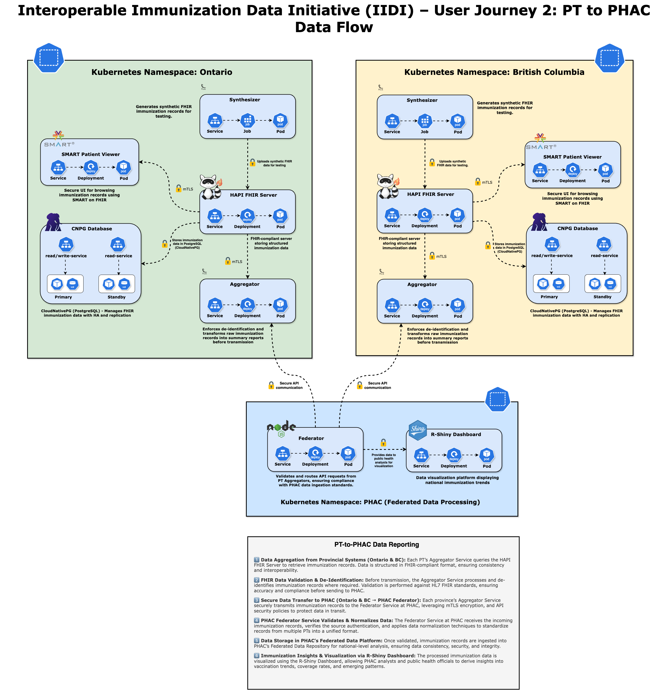

# **Interoperable Immunization Data Initiative (IIDI) – User Journey 2: PT-to-PHAC**

## **Technical Architecture and Implementation Strategy User Journey 2 (PT to PHAC)**

## **1. Introduction**

The **Interoperable Immunization Data Initiative (IIDI)** is designed to enable **secure, federated, and privacy-compliant immunization data sharing** between Provincial/Territorial (PT) health systems and the Public Health Agency of Canada (PHAC). This initiative follows a **distributed architecture**, ensuring that **each PT retains full control over its immunization records** while allowing for **standardized reporting and analytics** at the national level.

A core principle of IIDI is that **PHAC does not access, store, or process personal health information (PHI)**. Instead, **all de-identification and aggregation occur at the PT level** before data is transmitted. This ensures that only **pre-processed, anonymized immunization summaries** are shared with PHAC, aligning with federal and provincial privacy policies.

This document provides an **in-depth technical breakdown** of the IIDI architecture, detailing how **Kubernetes, CloudNativePG (CNPG), Flux, Kustomize, GitOps, FHIR, and SMART on FHIR technologies** are leveraged to **build a scalable, secure, and future-proof immunization data-sharing ecosystem**.

---

## **2. Deployment Architecture & Kubernetes Infrastructure**

### **2.1 Kubernetes Architecture and Namespace Isolation**

The IIDI infrastructure is fully deployed on **Google Kubernetes Engine (GKE)** with **namespace-based isolation** for each participating PT. Each **PT operates within its own namespace**, containing:

- **HAPI FHIR Server** – The core immunization record repository.
- **CloudNativePG (CNPG) Database** – A Kubernetes-native PostgreSQL instance for structured immunization data storage.
- **FHIR Aggregation Services** – Microservices for processing and anonymizing immunization data.
- **SMART on FHIR Patient Viewer** – A secure web-based application for browsing FHIR immunization records.

Namespaces are secured using **Kubernetes Role-Based Access Control (RBAC), NetworkPolicies, and Anthos Service Mesh (ASM)**, ensuring that PT workloads are fully isolated.

### **2.2 GitOps-Driven Deployment with Flux & Kustomize**

All deployments follow a **GitOps model** using **Flux and Kustomize**, ensuring that application configurations remain declarative, version-controlled, and continuously reconciled with production environments.

- **FluxCD**: Automates deployments by continuously monitoring GitHub repositories for configuration changes.
- **Kustomize**: Enables **environment-specific overlays**, allowing **PT-specific variations** while maintaining a consistent core deployment structure.
- **Cloud Build**: Handles **CI/CD pipelines**, ensuring that **image builds, and infrastructure changes** are validated before deployment.

This **declarative, version-controlled approach** ensures that all changes to the system are **traceable, reproducible, and securely managed**.

---

## **3. CloudNativePG (CNPG) for Immunization Data Management**

### **3.1 Why CloudNativePG?**

IIDI leverages **CloudNativePG (CNPG)** as a **Kubernetes-native PostgreSQL operator**, ensuring high availability, automated failover, and seamless integration with Kubernetes workloads. CNPG was chosen over traditional PostgreSQL deployments because:

- It follows the **Kubernetes Operator pattern**, making **PostgreSQL a first-class citizen in Kubernetes**.
- It enables **self-healing and automated failover**, ensuring high availability without external dependencies.
- It integrates directly with **Kubernetes Secrets, Persistent Volumes, and ConfigMaps** for seamless scaling and resilience.

### **3.2 CNPG Database Architecture**

Each PT namespace contains its own **CNPG database cluster**, which stores **FHIR-compliant immunization records**.

- **Automated Failover & High Availability**: If a primary node fails, CNPG automatically promotes a new primary, ensuring minimal downtime.
- **Streaming Replication & Read Scalability**: CNPG supports **read-only replicas**, optimizing performance for **real-time analytics and reporting queries**.
- **Rolling Updates & Immutable Containers**: PostgreSQL containers are updated using **zero-downtime rolling upgrades**, ensuring continuous availability.

Access to CNPG is **strictly governed via RBAC policies**, ensuring that **only authorized services (FHIR API, Aggregator, Federator) can query data**.

---

## **4. Immunization Data Processing & Aggregation**

### **4.1 Synthetic FHIR Data Generation**

Since this phase of the project is a **controlled simulation**, real patient data is not used. Instead, a **Flask-based Kubernetes Job (Synthesizer)** generates **FHIR-compliant synthetic immunization records**.

- Uses **Faker (Python)** to generate realistic **FHIR Patient, Immunization, and AllergyIntolerance resources**.
- Uploads the generated data to the **HAPI FHIR Server** via **FHIR transaction bundles**.
- Ensures that **FHIR resource structures align with PT-approved schemas**, maintaining consistency across jurisdictions.

### **4.2 Aggregation & Data Standardization**

Once immunization records are ingested, the **Aggregator microservice** processes and standardizes data before submitting it to PHAC.

- **FHIR Data Extraction**: Queries the **HAPI FHIR Server** for **Immunization and Patient data**.
- **De-identification & Grouping**: Data is categorized by:
  - **Jurisdiction (BC, ON)**
  - **Occurrence Year**
  - **Age Group**
  - **Sex**
  - **Vaccine Type**
  - **Dose**
- **API Endpoint (`/aggregated-data`)**: Exposes the processed dataset via a **REST API**, caching results to improve performance.

All aggregation happens **within PT namespaces**, ensuring that **PHAC only receives high-level, de-identified summaries**.

---

## **5. Secure Data Federation & Reporting**

### **5.1 Federated API Gateway**

Once PT data is aggregated, it is securely transmitted to PHAC via the **Federator component**.

- **Role**: Serves as an **API Gateway**, securely routing PT aggregation services to PHAC.
- **Security**:
  - **Mutual TLS (mTLS)** encryption ensures **end-to-end security**.
  - **Ingress controls with fine-grained RBAC** ensure **minimum-privilege access**.

### **5.2 R Shiny Dashboard for Visualization**

- Queries the **Federator API** for real-time immunization insights.
- Displays statistics per **jurisdiction, age group, and vaccine type**, supporting **national public health monitoring**.
