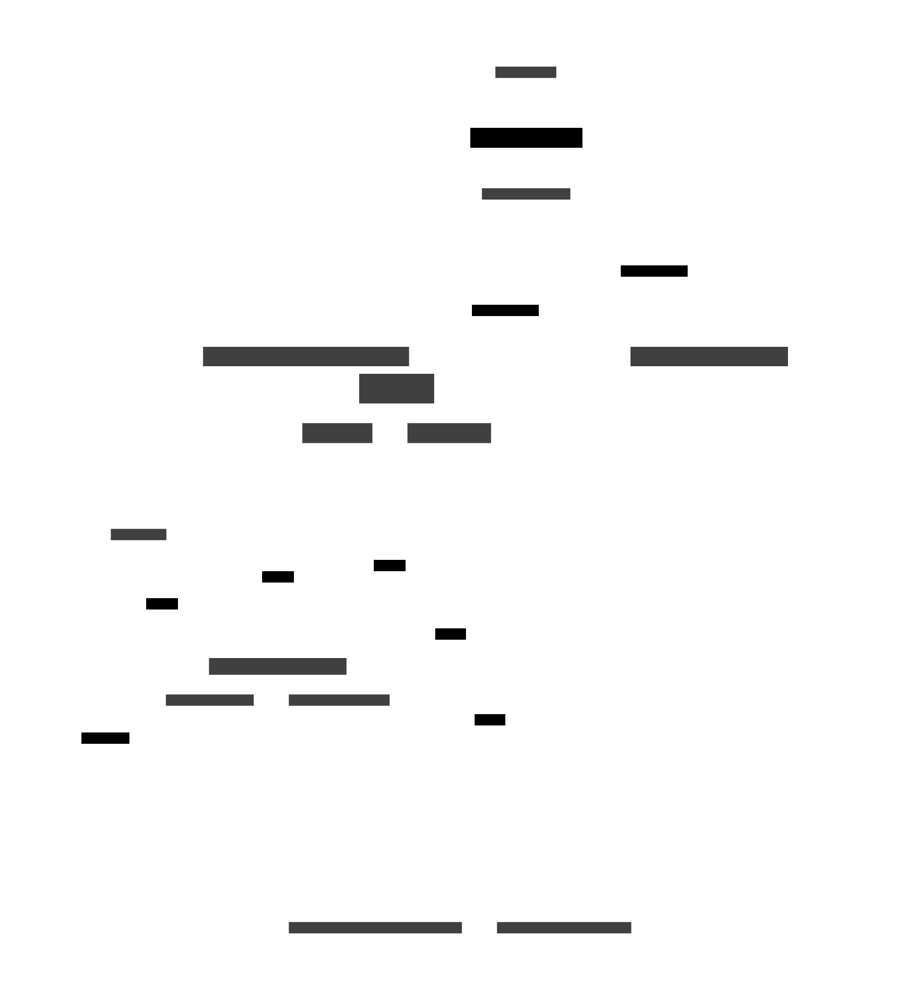

# Architecture

## Updating diagrams

The diagram is generated from [D2](https://d2lang.com/) code to allow versioning and rapid revisions. Install the [D2 CLI](https://d2lang.com/tour/install/) and the D2 VSCode extension before editing the `.d2` files.

To update a generated svg, `cd` in to this directory and run `d2 <filename>.d2`. Add the `-w` flag for watch mode for a live-updating browser view while editing.

## Diagrams

### POC Local Dev Architecture/Demo Fallback

How we can locally develop IIDI components. Fall back POC Demo if connections to ON and BC systems not achieved.

### POC Anticipated/Target Architecture (assuming provincial support)

How we can integrate this IIDI POC with available ON and BC systems to achieve the target demo state.

