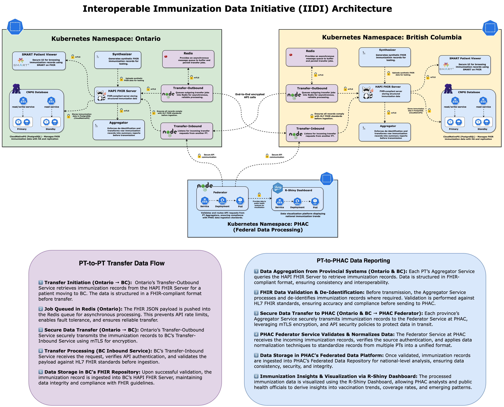

# Welcome to IIDI-Tech Documentation

## Table of Contents

- [Overview](#overview)
- [System Components & Architecture](#system-components--architecture)
- [PT-to-PT Transfer Data Flow](#-pt-to-pt-transfer-data-flow)
- [PT-to-PHAC Data Reporting](#-pt-to-phac-data-reporting)
- [Why IIDI Matters](#why-iidi-matters)
- [Next Steps](#next-steps)

---

## Overview

The **Interoperable Immunization Data Initiative (IIDI)** aims to enhance the interoperability of immunization data across various jurisdictions. The initiative involves three pillars of interoperability – standards, governance and technology. The IIDI Phase 1 Proof of Concept (PoC) focusses on implementing a federated data architecture to enable seamless immunization record transfer and access between jurisdictions and with the Public Health Agency of Canada (PHAC). A **federated data-access architecture** is designed to facilitate **secure, standardized, and real-time immunization data exchange** between **provincial and federal health systems** in Canada. This initiative enables **inter-provincial (PT-to-PT) immunization record access** and **data reporting to PHAC (Public Health Agency of Canada)** for national surveillance and analysis.

The Phase 1 PoC leverages **FHIR-based APIs, Kubernetes-based microservices, Redis for job queuing, and R-Shiny for visualization**, ensuring a robust, scalable, and privacy-compliant ecosystem.

---

## **System Components & Architecture**

### **Provincial Kubernetes Namespaces: Ontario & British Columbia**

Each **province operates its own Kubernetes namespace**, where immunization records are accessed and transferred securely. Key components include:

- **SMART Patient Viewer**: Allows healthcare providers to view immunization records in a FHIR-compliant format.
- **HAPI FHIR Server**: Serves as the **FHIR repository**, enabling data access.
- **FHIR Aggregator Service**: Extracts and prepares data for **PT-to-PT access and PT-to-PHAC reporting**.
- **FHIR Synthesizer**: Generates **synthetic FHIR data** for testing and validation.
- **Redis Queue**: Handles **asynchronous processing** to manage API rate limits and ensure resilience.
- **Transfer Services (Outbound & Inbound)**: Enable **secure retrieval and exchange** of immunization records across jurisdictions.

_Reference Diagram:_

---

### **Federal Kubernetes Namespace: PHAC (Federal Data Processing)**

At the federal level, PHAC processes immunization data for **national-level analysis**. Core services include:

- **FHIR Federator Service**: Receives and **normalizes** immunization records from multiple provinces.
- **R-Shiny Dashboard**: Provides **visual insights** for public health officials, helping track **coverage trends, vaccine uptake, and emerging patterns**.

---

## **PT-to-PT Transfer Data Flow**

### **1️⃣ Transfer Initiation (Ontario → BC)**

- Ontario’s **Transfer-Outbound Service** retrieves immunization records from the **HAPI FHIR Server** for a **migrating patient**.
- Data is structured in **FHIR-compliant JSON** format.

### **2️⃣ Job Queued in Redis (Ontario)**

- The JSON payload is **queued in Redis** to handle API rate limits and ensure reliable processing.

### **3️⃣ Secure Data Transfer (Ontario → BC)**

- Ontario’s **Transfer-Outbound Service** encrypts and transmits the immunization record to **BC’s Transfer-Inbound Service** via **mutual TLS (mTLS)**.

### **4️⃣ Transfer Processing (BC Inbound Service)**

- BC’s **Transfer-Inbound Service** verifies **API authentication** and validates the payload using **HL7 FHIR standards**.

### **5️⃣ Immunization Record Access in BC’s FHIR Repository**

- The immunization record is **accessible in BC’s HAPI FHIR Server**, ensuring compliance with **FHIR guidelines**.

---

## **PT-to-PHAC Data Reporting**

### **1️⃣ Data Aggregation from Provincial Systems**

- Each province’s **FHIR Aggregator Service** queries the **HAPI FHIR Server** to retrieve structured immunization records.

### **2️⃣ FHIR Data Validation & De-Identification**

- The **FHIR Aggregator Service** processes and **de-identifies** immunization records.
- Validation is performed against **FHIR standards** to ensure **accuracy & compliance** before federal reporting.

### **3️⃣ Secure Data Transfer to PHAC**

- Each province’s **FHIR Aggregator Service** securely transmits records to PHAC’s **FHIR Federator Service** using:
  - **TLS encryption**
  - **API security policies** for protection in transit

### **4️⃣ PHAC’s Federator Service Validates & Normalizes Data**

- The **FHIR Federator Service** at PHAC:
  - Receives and **normalizes** records
  - **Removes inconsistencies**
  - **Standardizes FHIR fields** from multiple PTs into a unified format

### **5️⃣ Data Access via PHAC’s Federated Data Platform**

- Once validated, immunization records are **accessible** through **FHIR APIs** for **national surveillance & trend analysis**.

### **6️⃣ Immunization Insights via R-Shiny Dashboard**

- Processed data is **visualized** in **R-Shiny Dashboards** for:
  - **Tracking vaccine trends**
  - **Identifying coverage gaps**
  - **Monitoring emerging patterns**

---

## **Next Steps**

- 📄 Read the [Getting Started Guide](getting-started.md) to set up your environment.
- 🔍 Explore the [Architecture Overview](architecture/GCP-Architecture.md).
- 🛠 Check out the [API Reference](api/aggregation.md) for integration details.
